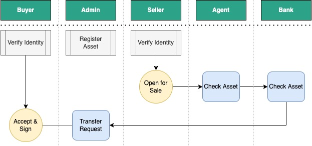
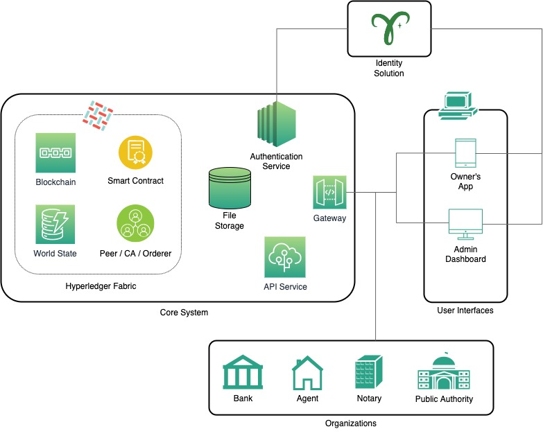
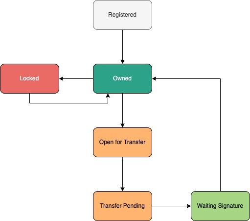
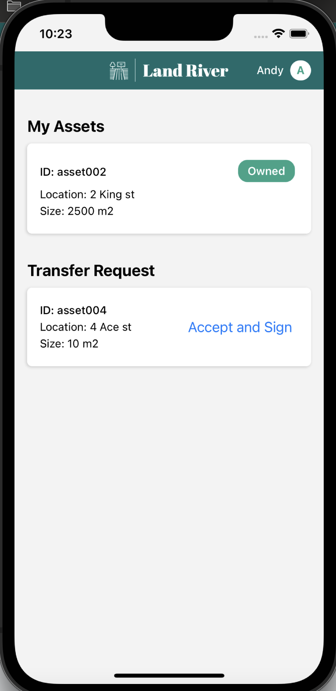
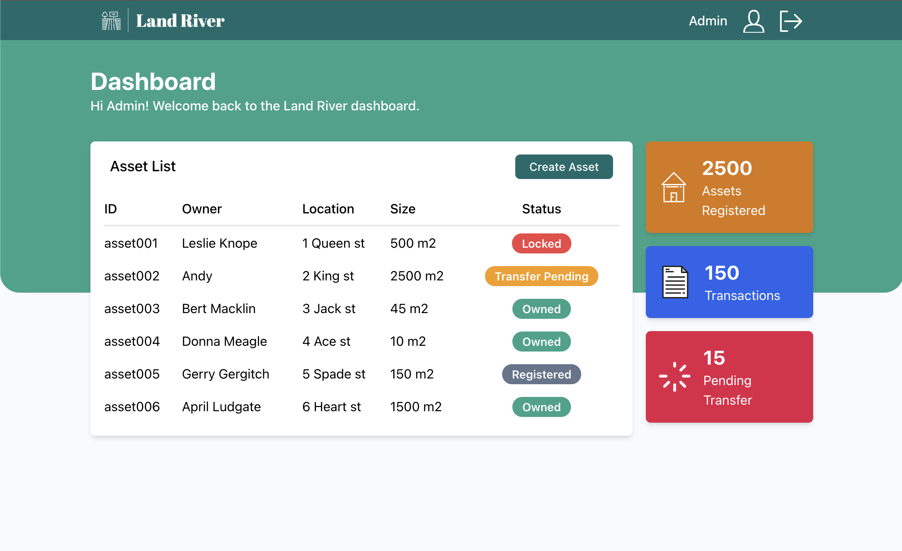
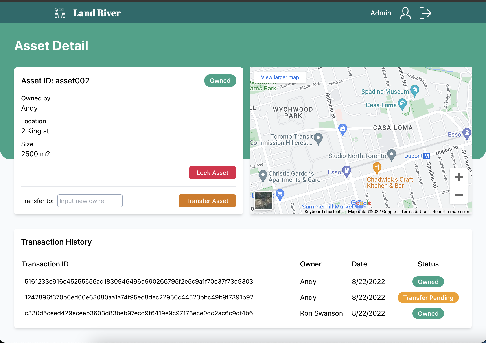

# Land River

Transparent and semaless land title registration solution, built using Hyperledger Fabric.

### This project is a part of Capstone Project - George Brown College

---

A continuation of [Blockchain Land Registry](https://github.com/rumjuice/blockchain-land-registry.git) project.

Previous Contributors:

- Ravshan: [LinkedIn](https://www.linkedin.com/in/rmakhmadaliev/) [GitHub](https://github.com/Ravshann)

- Jainam: [LinkedIn](https://www.linkedin.com/in/jainmshah/) [GitHub](https://github.com/naxer-12)

- Hossein: [LinkedIn](https://www.linkedin.com/in/hossein-hesami-5a565b78/) [GitHub](https://github.com/DarioHesami)

- Ramdhani: [LinkedIn](https://www.linkedin.com/in/ramdhaniharis/) [GitHub](https://github.com/rumjuice)

---

## Problem Description

Many people are losing their land because of the fraud in land registry. A land can have multiple legal owners. As a matter of fact, **only 30% of the world population has their land registered LEGALLY**

The process to transfer is extensive, too many documents and verifications with more than one organizations. This paper documents can be lost.

With Land River, all the documents are stored digitally, and the hash is stored on the blockchain so that it's transparent and can't be duplicated. All the history of land transfer transaction are stored on the blockchain.

> Secure land and property rights are not only at the heart of sustainable development, but they should also be lifted to the top of the global agenda. (_world bank, 2019_)

## Requirements

The system should run with at least 2 organizations:

1. Administrator (Governement - Land Registration Authority)
2. Private stakeholders (Banks, Real estate agent, Notary, Public local authority)

The core system of Land River can handle Transfering asset, asset management, digital paper trail, and digital signature for seller and buyer.

## Process Flow Diagram

## Architecture Diagram

The system consist of:

1. Blockchain Framework - Hyperledger Fabric
2. API Service - NodeJS
3. Admin Dashboard - ReactJS
4. Owner's mobile app - React Native
5. Integration with Identity Provider and other organizations (future plan)

## State Diagram

We named land property as 'asset' objects within the system. This diagram shows all possible states of an asset.

---

## Prerequisites

1. Ubuntu-18.0 (8GB RAM and 10+ GB disk storage) or MacOS
2. Docker & Docker Compose
3. Node >= 14
4. Yarn
5. Android Studio (for Android)
6. XCode (for iOS)

## Setup instructions

1. Go to apps folder and run this to avoid permission issues:  
   `sudo chmod -R +x fabric-network`
2. Go to apps/fabric-network and run to pull fabric images from docker hub:  
   `./pullFabricImages.sh`
3. Go to apps/fabric-network/test-network and run to build network up:  
   `./network.sh down`  
   `./network.sh up createChannel -ca -s couchdb`
4. From the same location run to deploy the chaincode:  
   `./network.sh deployCC -ccn basic -ccp ../../chaincode/ -ccl typescript`
5. Go to project root folder and run the whole app with:
   `yarn start`  
   _OR_
6. Go to project root folder and run to install all dependencies for frontend and backend:  
   `yarn install`
7. From project root folder run following to start backend application at port 8080:  
   `yarn backend start`
8. From project root folder run following to start backend application at port 3000:  
   `yarn frontend start`

### To run the mobile app

1. Build the styling  
   `yarn mobile tailwind:build`
2. For iOS  
   `yarn mobile pods`
3. To run iOS  
   `yarn mobile ios`
4. To run Android  
   `yarn mobile android`

## Screenshots

